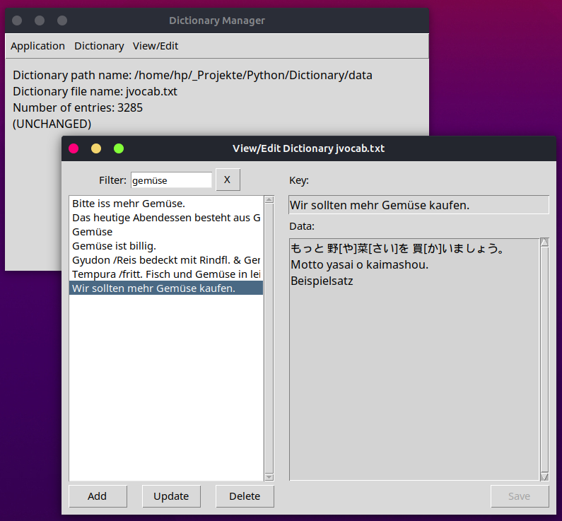
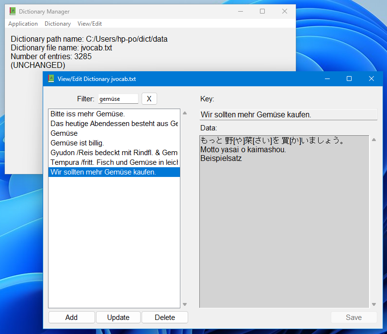

# Dictionary Manager

A simple dictionary manager in Python & Tkinter for viewing and editing
text files with lines in the form:

    key TAB data1 TAB data2 TAB ...
    
Keys must be unique - when reading the data file, subsequent lines with 
identical keys are ignored.

Screenshot Linux:

Screenshot Windows:

The displayed data record is saved as:

	Wir sollten mehr Gemüse kaufen. TAB もっと 野[や]菜[さい]を 買[か]いましょう。 TAB
    Motto yasai o kaimashou. TAB Beispielsatz

